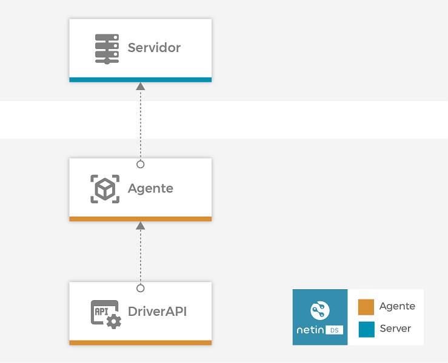

<!-- markdownlint-disable MD033 MD041 -->

<p align="center">
  <div style="text-align:center;background-color:#0091B3;">
    
  </div>
</p>

<h1 align="center">NetinDS - MQTT Broker Driver</h1>

<p align="center">
<a href="https://www.netin.io/product-netin-ds"> Librería Node.js® para NetinDS </a> - <a href="https://docs.netin.io/"> Documentación completa de NetinDS </a> - <a href="https://www.netin.io/services"> Soporte Netin Systems </a> - <a href="https://hub.docker.com/orgs/netinsystems"> NetinDS en Docker </a>
</p>

<!-- markdownlint-enable MD033 -->

[](https://snyk.io/package/npm/snyk)
[](https://devopmytra.visualstudio.com/NetinSystems/\_build/latest?definitionId=347\&repoName=NS-MQTT_Driver-NAP-TypeScript\&branchName=master)
[](https://nodejs.org/download/release/v12.13.0/)
[](https://hub.docker.com/r/netinsystems/netin-ds-drv-mqtt/tags?page=1\&ordering=last_updated)

***

## Inhaltsverzeichnis

*   [Einführung](#introducción)
*   [Installation](#instalación)
*   [Informationen](#información)
*   [Nutzung](#uso)
*   [Zusammenarbeit](#colaboración)
*   [Lizenz](#licencia)

## **Einführung**

**Makler-Pilot NetinDS MQTT** gehört allen offiziellen Piloten von **Netinds**. Ziel dieses Pilots ist es, die Erhebung von Daten von Vor-Ort-Geräten zu ermöglichen, die das MQTT-Protokoll leicht implementieren.



**Makler-Pilot NetinDS MQTT** ermöglicht:

*   Mit QoS 0, 1 und 2 Informationen von MQTT v3.1.1 und v5 in NetinDS einbetten.
*   Ausgabe von TIMEPOINTS vom Treiber selbst.
*   Nutzung als lokaler Makler.
*   MQTT Proxy - Übermittelt Nachrichten an andere Broker.
*   Weiße Listenoptionen für Themen und Kunden.
*   Überwachung des Zustands der Kunden.

## **Installation**

Wie die anderen Artefakte von **Netinds**, am **Makler-Pilot NetinDS MQTT** wird als ein [Artikfact](https://docs.netin.io). Es ist auch möglich, es mit Hilfe des Bildes zu verwenden [Docker](https://hub.docker.com/repository/docker/netinsystems/netin-ds-drv-mqtt).

## **Informationen**

### **Parameter des Piloten in den Modellen (*originTypes*)**

Hier ist ein Beispiel für die Konfiguration des netin-ds-Treibers

```yml
- originType: netin-ds-drv-mqtt
  source: 10.10.10.25
  topics:
    - topicName: /this/is/myTopic
      datapointSet: myDataPointSetId
      originStrategy:
        strategyId: address
      operationMode: transform
    - topicName: /this/is/myOtherTopic
      datapointSet: myOtherDataPointSetId
      originStrategy:
        strategyId: topic
        expression: /regExp/
      operationMode: extract
```

*   `originType`: muss immer sein `netin-ds-drv-mqtt`.
    > Für Multi-Treiber-Konfigurationen wenden Sie sich an den Unterstützungsdienst von Netin.
*   `source`: IP-Adresse oder `clientId` des MQTT-Kunden. Dieser Wert muss nicht speziell dem `origin` Informationen, insbesondere wenn die mit dem NetinDS-System verbundene Ausrüstung die an das NetinDS angeschlossenen Nachrichten von Geräten über ein anderes System "übermittelt". Ein Beispiel für diese Art von Konfiguration kann eine PLC-Ausrüstung sein(*Programmierbare logische Steuerung*) die Informationen über den Zustand der verschiedenen Ausrüstungen übermittelt, die mit einem Feldbus verbunden sind.
*   `topics`Spezifische Konfiguration der einzelnen `topic` die der Pilot übernehmen würde. Mehrere Konfigurationen können für ein und dieselbe Konfiguration durchgeführt werden `topic`, auf diese Weise erzeugt der Treiber mehrere Nachrichten (DatapointSets) für ein und dieselbe eingehende Nachricht. Dies kann insbesondere in folgenden Fällen von Nutzen sein:
    *   Unterschiedliche Nachrichten für verschiedene NetinHUB-Dienste.
    *   Teilung einer Nachricht in kleinere Nachrichten.

Innerhalb eines jeden `topic` wir haben folgende Parameter:

*   `topicName`: Name des `topic` oder regulärer Ausdruck (RexExp), der zur Identifizierung des `topic`. Die Verwendung regelmäßiger Ausdrücke ist besonders nützlich, wenn Sie den gleichen DatapointSet für mehrere erzeugen möchten `topics`.

*   `originStrategy`: legt fest, welche Strategie zur Identifizierung des `origin` Die Nachricht. Die Konfiguration dieser Strategie ist entscheidend, wenn wir Nachrichten über eine Art Aggregator erhalten (siehe Feld `source`).

    Das Ziel dieser Strategien ist: In einem System, in dem ein Aggregator Informationen aus verschiedenen Geräten sendet, haben wir nur einen MQTT-Kunden, der mit dem Broker verbunden ist, obwohl es in Wirklichkeit "dahinter" mehrere Geräte gibt. Jedes dieser Teams hat ein `origin` verschiedene, und können sogar verschiedene NetinDS-Modelle verwenden. In diesem Fall werden wir in der NetinDS-Entdeckungstabelle mehrere Computer mit dem gleichen Wert von `source` aber anders `origin`. Die vom Aggregator veröffentlichten Nachrichten können die Informationen enthalten, die wir benötigen, um die `origin`, obwohl alle Nachrichten vom gleichen MQTT-Kunden, dank der Strategie `property` wir könnten das Feld der Nachricht lesen, um diesen Verein zu realisieren.

    Die möglichen Strategien sind wie folgt:

    *   `topic`: der Ursprung wird aus dem Namen des `topic` indem wir einen regulären Ausdruck (RegExp) verwenden, den wir im Feld konfigurieren `expression`.
        Zum Beispiel:

        ```yml
        - topicName: health
          datapointSet: myHealthDatapointSet
          originStrategy:
            strategyId: topic
            expression: /\/data\/\K[^\/]+/
        ```

        Für Nachrichten, die auf dem `topic`: `/data/MY_ORIGIN/health` die Datenpunkt-Einstellungen anwenden würde `myHealthDatapointSet` und würde es mit dem `origin`: `MY_ORIGIN`.

        > Denken Sie daran, dass das Feld `topicName` wird auch als RegExp verwendet.

    *   `property`Die Quellquelle wird durch die im Feld konfigurierte RegExp-Anwendung bestimmt `expression` regelmäßig über das Eigentum der Nachricht (**HTML**) geleitet durch das Feld `property`. Wird kein Ausdruck angegeben, wird der Wert der Eigenschaft verwendet. `property` muss eine gültige Spurroute in Punktnotierung oder [HtmlPath](https://goessner.net/articles/JsonPath/).

        ```yml
        - topicName: health
          datapointSet: myHealthDatapointSet
          originStrategy:
            strategyId: property
            property: data.meta.name
            expression: /^[A-Z_]*/
        ```

        Für eine Nachricht wie:

        ```json
        {
          "data": {
            "value1": 2,
            "value1": "text",
            "meta": {
              "name": "MY_ORIGIN@123456"
            }
          },
          "timestamp": 4
        }
        ```

        Für Nachrichten, die auf dem `topic`: `/data/ANY_REFERENCE/health` die Datenpunkt-Einstellungen anwenden würde `myHealthDatapointSet` und würde es mit dem `origin`: `MY_ORIGIN`.

    Andere mögliche Strategien, aber für Fälle, in denen es keinen Aggregator gibt:

    *   `address`: wir verwenden die IP-Adresse des Kunden als `origen`.
    *   `clientId`: wir werden die `clientId` von MQTT als `origen`.
    *   `origin`: wir werden als `origin` seine eigene `origin` In der Registerkarte Entdeckung konfiguriert.

*   `operationMode`: legt fest, wie ETL-Operationen auf der empfangenen Nachricht durchgeführt werden:
    *   `transform`: In diesem Fall müssen die Adressen Ausdrücke sein [HtmlPath](https://goessner.net/articles/JsonPath/), beachten Sie, dass diese Option langsamer ist als der einfache Extraktionsmodus, verwenden Sie sie nur, wenn Sie eine Transformation auf die Nutzlast der Nachricht anwenden müssen und die entsprechenden Latenzen unterstützen können.
    *   `extract`In diesem Fall müssen die Adressen auf Punkt-Rating-Routen angegeben werden. Diese Option wird nur Daten extrahieren, ohne jegliche Umwandlung.

### **Interne Datenpunkte des Netin-ds-drv-mqtt**

Der MQTT-Treiber enthält folgende interne Datenpunkte:

*   `componentId` (`string`) Identifizierung des Bauteils in diesem Fall des MQTT-Kunden. Dieser Wert kann die IP-Adresse des Computers oder `deviceId` MQTT, abhängig von der entsprechenden Konfiguration. Anschrift NetinDS: `netin:drv:mqtt:componentId`.
*   `componentType` (`string`) ist eine Textkette in folgendem Format: `MQTT Client -V${version}`. Anschrift NetinDS: `netin:drv:mqtt:componentType`.
*   `time` (`string`) Datum der letzten Aktualisierung des Status des MQTT-Kunden im ISO8601-Format. Anschrift NetinDS: `netin:drv:mqtt:time`.
*   `output` (`string`|`string[]`) Text oder Fehlertexte, wenn der MQTT-Client einen hat. Anschrift NetinDS: `netin:drv:mqtt:output`.
*   `status` (`"pass"`| `"fail"`|`"warn"`) gibt den aktuellen Stand des MQTT-Kunden an. Anschrift NetinDS: `netin:drv:mqtt:status`.
*   `address` (`string`): IP-Adresse des MQTT-Kunden. Anschrift NetinDS: `netin:drv:mqtt:address`
*   `clientId` (`string`): `clientId` des MQTT-Kunden. Anschrift NetinDS: `netin:drv:mqtt:clientId`
*   `version` (`number`MQTT-Version, die vom MQTT-Client verwendet wird. Anschrift NetinDS: `netin:drv:mqtt:version`

Beispiel für die Konfiguration:

```yml
# MQTTDevice
- datapointSetType: map
  datapointSetId: MQTTDevice
  alias: MQTT device
  description: MQTT device state and information
  datapoints:
    - commonConfig:
        datapointId: componentId
        alias: Device identification
        description: 'Component identification, it should be deviceId or IP address'
        syntaxInfo: STRING
        datapointType: SIMPLE
      addressConfig:
        dataType: STRING
        originType: netin-ds-drv-mqtt
        originDataType: STRING
        originAddress: 'netin-ds-drv-mqtt:componentId'
        originAccessType: read-only
        receiveMode: polling
        pollingGroup: 10s
    - commonConfig:
        datapointId: componentType
        alias: Tipo de cliente
        description: 'Component type, it should be: MQTT Client - VX'
        syntaxInfo: STRING
        datapointType: SIMPLE
      addressConfig:
        dataType: STRING
        originType: netin-ds-drv-mqtt
        originDataType: STRING
        originAddress: 'netin-ds-drv-mqtt:componentType'
        originAccessType: read-only
        receiveMode: polling
        pollingGroup: 10s
    - commonConfig:
        datapointId: time
        alias: Last client state update date
        description: Last update of the device info in ISO8601 format
        syntaxInfo: STRING
        datapointType: SIMPLE
      addressConfig:
        dataType: STRING
        originType: netin-ds-drv-mqtt
        originDataType: STRING
        originAddress: 'netin-ds-drv-mqtt:time'
        originAccessType: read-only
        receiveMode: polling
        pollingGroup: 10s
    - commonConfig:
        datapointId: output
        alias: Error output
        description: Raw error output
        syntaxInfo: STRING
        datapointType: SIMPLE
      addressConfig:
        dataType: STRING
        originType: netin-ds-drv-mqtt
        originDataType: STRING
        originAddress: 'netin-ds-drv-mqtt:output'
        originAccessType: read-only
        receiveMode: polling
        pollingGroup: 10s
    - commonConfig:
        datapointId: status
        alias: Status
        description: Status of the MQTT device from the point of view of the broker
        syntaxInfo: STRING
        datapointType: SIMPLE
      addressConfig:
        dataType: STRING
        originType: netin-ds-drv-mqtt
        originDataType: STRING
        originAddress: 'netin-ds-drv-mqtt:status'
        originAccessType: read-only
        receiveMode: polling
        pollingGroup: 10s
    - commonConfig:
        datapointId: ipAddress
        alias: IP Address
        description: MQTT client IP Address
        syntaxInfo: STRING
        datapointType: SIMPLE
      addressConfig:
        dataType: STRING
        originType: netin-ds-drv-mqtt
        originDataType: STRING
        originAddress: 'netin-ds-drv-mqtt:address'
        originAccessType: read-only
        receiveMode: polling
        pollingGroup: 10s
    - commonConfig:
        datapointId: clientId
        alias: Client identification
        description: MQTT clientId
        syntaxInfo: STRING
        datapointType: SIMPLE
      addressConfig:
        dataType: STRING
        originType: netin-ds-drv-mqtt
        originDataType: STRING
        originAddress: 'netin-ds-drv-mqtt:clientId'
        originAccessType: read-only
        receiveMode: polling
        pollingGroup: 10s
    - commonConfig:
        datapointId: version
        alias: MQTT client version
        description: MQTT client version
        syntaxInfo: STRING
        datapointType: SIMPLE
      addressConfig:
        dataType: STRING
        originType: netin-ds-drv-mqtt
        originDataType: STRING
        originAddress: 'netin-ds-drv-mqtt:version'
        originAccessType: read-only
        receiveMode: polling
        pollingGroup: 10s
```

## **Nutzung**

### **Umweltvariablen**

#### Einstellungen NetinDS DriverAPI

#### Allgemeine Parameter des DriverAPI

*   **`CONFIG_DRIVER_ARTIFACT_ID`** standardmäßig,`netin-ds-drv-mqtt`) Name des Piloten aus der Sicht von NetinDS.
    > *Seine Änderung wird nicht empfohlen, wenn nicht bekannt ist, was getan wird.*
*   **`CONFIG_DRIVER_UPDATE_INTERVAL`** standardmäßig,`60000`) Zeitintervall für die Überprüfung von Änderungen in der Ursprünglichkeitskonfiguration (netinDS Addresses).
*   **`CONFIG_DRIVER_AUTO_UPDATE`** standardmäßig,`false`): ermöglicht es DriverAPI, die ursprünglichen Einstellungen (NetinDS Addresses) automatisch zu aktualisieren, wenn Änderungen erkannt werden.
    > *Seine Änderung wird nicht empfohlen, wenn nicht bekannt ist, was getan wird.*
*   **`CONFIG_DRIVER_LAZY_START`** standardmäßig,`false`) den Piloten anzuweisen, dass er beim Start einen Rotationsprozess auf dem System durchführt.
    > *Seine Änderung wird nicht empfohlen, wenn nicht bekannt ist, was getan wird.*
*   **`CONFIG_DRIVER_HEALTH_PORT`** standardmäßig,`29100`): Der Port, auf dem die REST API für die Beobachtbarkeit von [**@netin-js/DriverAPI**](https://devopmytra.visualstudio.com/NetinSystems/\_wiki/wikis/netin-js%20-%20DriverAPI/2609/-netin-js-Driver-API).
*   **`CONFIG_DRIVER_AGENT_HOST_ADDRESS`** standardmäßig,`localhost`) IP-Adresse des Systems, in dem sich das System befindet **Agent Engine NetinDS**.
*   **`CONFIG_DRIVER_DISCOVERY_HOST_ADDRESS`** default (undefined): IP-Adresse des Hosts, in dem sich der Service befindet **Entdeckung** des **Netin Agent**. Wenn sie konfiguriert ist, wird sie anstelle von `agentHostAddress`.
*   **`CONFIG_DRIVER_RDB_HOST_ADDRESS`** default (undefined): IP-Adresse des Hosts, in dem sich der Service befindet **RDB** des **Netin Agent**. Wenn sie konfiguriert ist, wird sie anstelle von `agentHostAddress`.

#### Einstellungen des Ereignisprotokolls (logger) [@netin-js](https://devopmytra.visualstudio.com/NetinSystems/\_packaging?\_a=package\&feed=Netin-Systems-Packages\&package=%40netin-js%2Flogger\&protocolType=Npm\&version=1.2.2)

##### Inschrift pro Konsole

*   **`CONFIG_LOGGER_CONSOLE_ENABLE`** standardmäßig,`false`) Konsolenlogger aktivieren.
*   **`CONFIG_LOGGER_CONSOLE_LEVEL`** standardmäßig,`'info'`) Aufzeichnungsstufe.

##### Registrierung nach Datei

*   **`CONFIG_LOGGER_FILE_ENABLE`** standardmäßig,`true`) Aktivierung des Dateiloggers.
*   **`CONFIG_LOGGER_FILE_LEVEL`** standardmäßig,`'info'`) Aufzeichnungsstufe.
*   **`CONFIG_LOGGER_FILE_FILE_NAME`** standardmäßig,`'logs/netin-ds-drv-mqtt.log'`Name der Protokolldatei.
*   **`CONFIG_LOGGER_FILE_MAX_FILES`** standardmäßig,`10`): Maximale Anzahl von Dateien (Rotation).
*   **`CONFIG_LOGGER_FILE_MAX_SIZE`** standardmäßig,`10 * 1000000`) maximale Größe in Bytes der Datei.
*   **`CONFIG_LOGGER_FILE_ZIPPED`** standardmäßig,`true`) gibt an, dass alle Protokolldateien komprimiert sind, mit Ausnahme der derzeit geschriebenen
*   **`CONFIG_LOGGER_FILE_JSON`** standardmäßig,`false`) Gibt an, ob das Format json oder string ist, standardmäßig string.

##### Registrierung durch den ***Flüssigkeit***

*   **`CONFIG_LOGGER_FLUENTD_ENABLE`** standardmäßig,`false`) Logger durch Fluentd aktivieren.
*   **`CONFIG_LOGGER_FLUENTD_LEVEL`** standardmäßig,`'info'`) Aufzeichnungsstufe.
*   **`CONFIG_LOGGER_FLUENTD_HOST`** standardmäßig,`'localhost'`) Host, wo sich der Fluentd-Service befindet.
*   **`CONFIG_LOGGER_FLUENTD_PORT`** standardmäßig,`28930`) Host, wo sich der Fluentd-Service befindet.
*   **`CONFIG_LOGGER_FLUENTD_TIMEOUT`** standardmäßig,`5000`): richtet die Ausfallzeit des Sockets an.
*   **`CONFIG_LOGGER_FLUENTD_ACK_RESPONSE`** standardmäßig,`true`) ändert das Protokoll in at-least-one. Der Holzschnitt wartet auf den Ack der Abteilung.
*   **`CONFIG_LOGGER_FLUENTD_RECONNECT_INTERVAL`** standardmäßig,`5000`): Legt den Rekonnexionsintervall in Millisekunden fest.
*   **`CONFIG_LOGGER_FLUENTD_EVENT_MODE`** standardmäßig,`'Message'`) : Definiert die Art und Weise der Behandlung von Ereignissen. Sie werden unterstützt. `Message`, `PackedForward` y `CompressedPackedForward`. Siehe [Veranstaltungsmodi](https://github.com/fluent/fluentd/wiki/Forward-Protocol-Specification-v1#event-modes).
*   **`CONFIG_LOGGER_FLUENTD_TLS`** standardmäßig,`false`): aktiviert die Verwendung von TLS auf diesem Socket.
*   **`CONFIG_LOGGER_FLUENTD_FLUSH_INTERVAL`** standardmäßig,`2000`) keine Wirkung im Message-Modus hat. Das Loggern speichert die Ereignisse und sendet sie in jedem Flush-Intervall.
*   **`CONFIG_LOGGER_FLUENTD_MESSAGE_SEND_QUEUE_SIZE`** standardmäßig,`100 * 1024 * 1024`) keine Wirkung im Message-Modus hat. Größe der Warteschlange der Byte-Nachrichten.

##### Aufzeichnungsebenen

Da die Aufzeichnungsebenen gestapelt sind, vervollständigt jede Ebene die vorhergehende Ebene, indem sie mehr Details über das gleiche Ereignis oder Stream zeigt. Die Verwendung des entsprechenden Niveaus für jede Art von Registrierung ist von großer Bedeutung, insbesondere in Produktionssystemen, in denen ein hohes Niveau von Aufzeichnungen die Leistung der Systeme erheblich verringern kann:

*   `error`: Jeder fatale Fehler bei der Operation, sollte aber nicht für den Dienst oder die Anwendung sein. Diese Art von Fehler erfordert das Eingreifen von Systemadministratoren oder Benutzern, um das Problem zu beheben.
*   `warn`: Ereignisse, die unerwünschtes Verhalten im System verursachen können, versucht das System, sich selbst von dem Ereignis zu erholen, aber ein seltsames Verhalten kann in der Anwendung auftreten.
*   `info`: Nützliche Informationen für Systemadministratoren (Start/Ausschalten, Version der Anwendung, Verbindungen mit externen Ressourcen...)
*   `verbose`: Nützliche Informationen, um alle Schritte einer Anwendung zu kennen, die sich an Administratoren wenden, die versuchen, die Entscheidungsfindung, die Grundlage der Entscheidungsfindung oder den Grund für die Ereignisse einer Anwendung oder eines Systems zu kennen.
*   `debug`: - Nützliche Informationen für die Diagnose von Systemen oder Diensten, nicht nur für Entwickler (Konfigurationen, Betriebsarten...).
*   `silly`: - Spezifische Informationen, die verwendet werden, um das Verhalten des Codes in einer bestimmten Funktion zu verfolgen.

#### Einstellungen des MQTT-Brokers

#### Service-Einstellungen

*   **`CONFIG_BROKER_HOST`** standardmäßig,`0.0.0.0`): IP-Adresse, an die der MQTT-Broker gebunden ist.
*   **`CONFIG_BROKER_PORT`** standardmäßig,`1883`): Hafen, auf dem der Service angeboten wird.
*   **`CONFIG_BROKER_MODE`** standardmäßig,`tcp`): Arbeitsweise des MQTT-Brokers. Die gültigen Optionen sind `tcp` o `tls`verpflichtet dies zur Konfiguration der Zertifikate für den MQTT-Broker.
*   **`CONFIG_BROKER_FILE_CERT_PATH`** standardmäßig,`certs/cert-broker.pem`Pfad zur Zertifikatsdatei für den Server. Nur im Modus verwendet `tls`.
*   **`CONFIG_BROKER_FILE_KEY_PATH`** standardmäßig,`certs/key-broker.pem`) Zugang zu der privaten Schlüsseldatei. Nur im Modus verwendet `tls`.
*   **`CONFIG_BROKER_FILE_CA_PATH`** standardmäßig,`certs/ca-broker.pem`): Pfad zur Ca-Zertifikatsdatei. Nur im Modus verwendet `tls`.

#### Leistungsparameter und Grenzwerte

*   **`CONFIG_BROKER_CONCURRENCY`** standardmäßig,`100`) Anzahl konkurrierender Nachrichten, die vom Makler verwaltet werden. Dieser Wert ist unabhängig von der Größe des Puffers für die Veröffentlichung von Datenpunkten auf NetinDS, d. h. er ist ein Puffer, der vor dem des NetinDS DriverAPI liegt.
*   **`CONFIG_BROKER_QUEUE_LIMIT`** standardmäßig,`42`) Maximale Anzahl von Nachrichten in einer Warteschlange, bevor das MQTT-Gerät angeschlossen ist.
    > *Diese Option ist für die zukünftige Verwendung des MQTT Brokers definiert, in der Version 1.X.X ist das System eine Einbahnstraße, d. h. es sollten keine Abonnenten mit dem Broker verbunden sein, nur produzenten. Obwohl die Systemkonfiguration durchaus möglich ist, um Abonnements zu ermöglichen.*
*   **`CONFIG_BROKER_MAX_CLIENTS_LENGTH`** standardmäßig,`23`): Maximale KundengrößeId von MQTT-Kunden.
*   **`CONFIG_BROKER_HEARTBEAT_INTERVAL`** standardmäßig,`60000`): Dauer des Veröffentlichungsintervalls des Signals *Herzschlag* auf dem Kanal `$SYS/${CONFIG_BROKER_ID}/heartbeat`.
*   **`CONFIG_BROKER_ID`** standardmäßig,`netin-ds-drv-mqtt`Kennung des MQTT-Brokers, der in den Diagnosepersonen des Maklers verwendet wird.
*   **`CONFIG_BROKER_CONNECT_TIMEOUT`** standardmäßig,`30000`) maximale Wartezeit für den MQTT-Kunden, bis er sich vor dem Schälen ausschöpft [`CONNECT`](https://en.wikipedia.org/wiki/MQTT) nach der Verbindung zwischen TCP und TCP.
*   **`CONFIG_BROKER_MQ_MIDDLEWARE`** standardmäßig,`default`) Art des Austauschs von Nachrichten. Im Fall der Verwendung im Modus `cluster` des Systems muss diese Variable als `redis` und die Redis-Optionen (siehe andere Umgebungsvariablen) müssen richtig konfiguriert werden. Die gültigen Optionen sind `default` ó `redis`.
    > *Die Option für den Betrieb im Cluster-Modus wurde in version 1.X.X nicht für stabil erklärt.*
*   **`CONFIG_BROKER_PERSISTENCE_MIDDLEWARE`** standardmäßig,`default`Middleware, die Nachrichten speichert `QoS > 0`, `retained` y `LWT` (*Letztes Testament*). Wenn die Verwaltung dieser Nachrichten über ein Persistent-System erforderlich ist, wird empfohlen, mit dem Cluster-Modus von Redis zu verwenden, für den diese Variable als `redis` und die Redis-Optionen (siehe andere Umgebungsvariablen) müssen richtig konfiguriert werden.
    > *Diese Option ist für die zukünftige Verwendung des MQTT Brokers definiert, in der Version 1.X.X ist das System eine Einbahnstraße, d. h. es sollten keine Abonnenten mit dem Broker verbunden sein, nur produzenten. Obwohl die Systemkonfiguration durchaus möglich ist, um Abonnements zu ermöglichen. Ohne Abonnenten macht die Verwaltung dieser Art von Nachrichten keinen Sinn*

#### Sicherheitsparameter

*   **`CONFIG_BROKER_USERNAME`** standardmäßig,`undefined`) ein einziger Benutzer zur Validierung von MQTT-Kunden verwendet. - Fakultativ.
*   **`CONFIG_BROKER_PASSWORD`** standardmäßig,`undefined`Für die Validierung von MQTT-Clients wird ein einheitliches Kennwort verwendet. - Fakultativ.
*   **`CONFIG_BROKER_WHITE_LISTED_ORIGINS`** standardmäßig,`true`) Diese Option zeigt an, dass nur die Verbindung der in NetinDS konfigurierten Geräte mit dem Broker erlaubt ist.
*   **`CONFIG_BROKER_WHITE_LISTED_PUBLICATIONS_TOPICS`** standardmäßig,`false`) Diese Option zeigt an, dass nur topic-konforme Nachrichten mit der in der Variablen angegebenen RegExp-konform sind `CONFIG_BROKER_PUBLICATIONS_REGEXP`.
*   **`CONFIG_BROKER_PUBLICATIONS_REGEXP`** standardmäßig,`[\\s\\S]*`): RegExp wird zur Validierung von Topic in Veröffentlichungsprozessen verwendet. Nur verwendet, wenn `CONFIG_BROKER_WHITE_LISTED_PUBLICATIONS_TOPICS` ist `true`.
*   **`CONFIG_BROKER_ALLOW_SUBSCRIPTIONS`** standardmäßig,`false`) Diese Option zeigt an, ob es möglich ist, Makler-Subjekte auszutrocknen oder nicht.
*   **`CONFIG_BROKER_WHITE_LISTED_SUBSCRIPTIONS_TOPICS`** standardmäßig,`false`) Diese Option zeigt an, dass nur topic-konforme Nachrichten mit der in der Variablen angegebenen RegExp-konform sind `CONFIG_BROKER_SUBSCRIPTIONS_REGEXP`.
*   **`CONFIG_BROKER_SUBSCRIPTIONS_REGEXP`** standardmäßig,`[\\s\\S]*`): RegExp wird zur Validierung von Topic-Abo-Prozessen verwendet. Nur verwendet, wenn `CONFIG_BROKER_WHITE_LISTED_SUBSCRIPTIONS_TOPICS` ist `true`.

#### Parameter für die Übertragung von Nachrichten

*   **`CONFIG_BROKER_PROXY_ENABLED`** standardmäßig,`false`) ermöglicht die Übertragung von Nachrichten, die von den Nachrichten-Kunden an einen anderen Broker veröffentlicht werden.
*   **`CONFIG_BROKER_PROXY_URL`** standardmäßig,`''`) URL für die Verbindung zum MQTT-Broker, die verwendeten Protokolle können sein: `mqtt`, `mqtts`, `tcp`, `tls`, `ws`, `wss`. Für Optionen *sicher.* Vergessen Sie nicht zu konfigurieren `CONFIG_BROKER_PROXY_MODE` wie `tls`sowie die entsprechenden Zertifikate und deren Konfiguration mit Hilfe der Routenvariablen `CONFIG_BROKER_PROXY_***_PATH` unten angegeben.
*   **`CONFIG_BROKER_PROXY_TOPIC`** standardmäßig,`''`) thema, bei dem die Nachrichten zu übermitteln sind.
*   **`CONFIG_BROKER_PROXY_USERNAME`** standardmäßig,`undefined`) benutzer verwendet von MQTT Proxy.
*   **`CONFIG_BROKER_PROXY_PASSWORD`** standardmäßig,`undefined`Passwort, das vom MQTT-Proxy verwendet wird.
*   **`CONFIG_BROKER_PROXY_CLIENT_ID`** standardmäßig,`netin-ds-drv-mqtt`ClientId wird vom MQTT-Proxy verwendet.
*   **`CONFIG_BROKER_PROXY_MODE`** standardmäßig,`tcp`) die Funktionsweise des MQTT-Proxys. Die gültigen Optionen sind `tcp` o `tls`dies erfordert die Konfiguration der Zertifikate für den MQTT-Proxy.
*   **`CONFIG_BROKER_PROXY_FILE_CERT_PATH`** standardmäßig,`certs/cert-proxy-client.pem`Der Proxy-Pfad zur Zertifikatsdatei. Nur im Modus verwendet `tls`.
*   **`CONFIG_BROKER_PROXY_FILE_KEY_PATH`** standardmäßig,`certs/key-proxy-client.pem`) Zugang zu der privaten Schlüsseldatei. Nur im Modus verwendet `tls`.
*   **`CONFIG_BROKER_PROXY_FILE_CA_PATH`** standardmäßig,`certs/ca-proxy-client.pem`): Pfad zur Ca-Zertifikatsdatei. Nur im Modus verwendet `tls`.

#### Fehlerbehebungsparameter

*   **`CONFIG_BROKER_DEBUG_MODE`** standardmäßig,`false`): Konfiguriert den Makler im Debuggenmodus, so dass alle Interaktionen mit verbundenen MQTT-Kunden aufgezeichnet werden können.

#### Redis Middleware-Konfiguration für Persistenz und Cluster

*   **`CONFIG_MIDDLEWARE_REDIS_ADDR`** standardmäßig,`'redis://127.0.0.1:28910/1'`) Verknüpfungs-URL zur Redis-Instanz. Es kann auch mit den Variablen konfiguriert werden: `CONFIG_MIDDLEWARE_REDIS_HOST`, `CONFIG_MIDDLEWARE_REDIS_PORT` y `CONFIG_MIDDLEWARE_REDIS_DB`.
*   **`CONFIG_MIDDLEWARE_REDIS_HOST`** standardmäßig,`'127.0.0.1'`) IP-Adresse, wo sich die Redis-Instanz befindet.
*   **`CONFIG_MIDDLEWARE_REDIS_PORT`** standardmäßig,`28910`): Hafen, in dem sich die Redis-Instanz befindet.
*   **`CONFIG_MIDDLEWARE_REDIS_DB`** standardmäßig,`1`DB-Nummer zu verwenden.
*   **`CONFIG_MIDDLEWARE_REDIS_USERNAME`** standardmäßig,`undefined`) Redis-Benutzer.
*   **`CONFIG_MIDDLEWARE_REDIS_PASSWORD`** standardmäßig,`undefined`Passwort Redis.
*   **`CONFIG_MIDDLEWARE_REDIS_RETRY_DELAY_FACTOR`** standardmäßig,`2000`) neuer Versuchsfaktor für die Verbindung in Millisekunden, d. h. Takt, der jedem neuen Versuch hinzugefügt wird.
*   **`CONFIG_MIDDLEWARE_REDIS_RETRY_DELAY_MAX`** standardmäßig,`60000`) maximale Zeit zwischen dem neuen Verbindungsversuch.
*   **`CONFIG_MIDDLEWARE_REDIS_KEEPALIVE`** standardmäßig,`10000`) die Redis-Verbindung lebendig halten.
*   **`CONFIG_MIDDLEWARE_REDIS_CONNECTION_TIMEOUT`** standardmäßig,`10000`) Timeout, um die Verbindung mit der Redis-Instanz herzustellen.
*   **`CONFIG_MIDDLEWARE_REDIS_LAZY_START`** standardmäßig,`true`) Die Kommunikation beim Start starten.
    > *Die Änderung der Variablen wird nicht empfohlen, wenn nicht bekannt ist, was getan wird.*

## Zusammenarbeit

Wie in anderen Benchmarks von **Netin-Systeme**, jede Zusammenarbeit wird immer gut angenommen.

Wenn Sie glauben, dass es einen Fehler gibt, erstellen Sie eine [Bug](https://docs.microsoft.com/en-us/azure/devops/boards/backlogs/manage-bugs) alle möglichen Informationen zur Verfügung stellen.

Wenn Sie einen neuen Beitrag leisten möchten, erstellen Sie einen neuen Zweig, wobei Sie jederzeit den von [Git-Flow](https://www.atlassian.com/es/git/tutorials/comparing-workflows/gitflow-workflow), die Änderungen vornehmen und ihre Zustimmung durch [Antrag auf Zugkraft](https://docs.microsoft.com/en-us/azure/devops/repos/git/pull-requests?view=azure-devops), indem das Modell des Modells richtig ausgefüllt wird.

## Lizenz

Copyright 2021 Network Intelligence S.L. Alle Rechte vorbehalten.

Hinweis: Alle hier enthaltenen Informationen sind und verbleiben im Eigentum von Network Intelligence S.L. und seinen Anbietern, falls vorhanden. Die hier enthaltenen intellektuellen und technischen Konzepte sind Eigentum von Network Intelligence S.L. und seinen Anbietern und können durch europäische und ausländische Patente, laufende Patente abgedeckt werden und sind durch Geschäftsgeheimnis oder Urheberrecht geschützt.
Die Verbreitung dieser Informationen oder die Vervielfältigung dieses Materials ist streng verboten, es sei denn, die vorherige schriftliche Genehmigung wird von Network Intelligence eingeholt.
