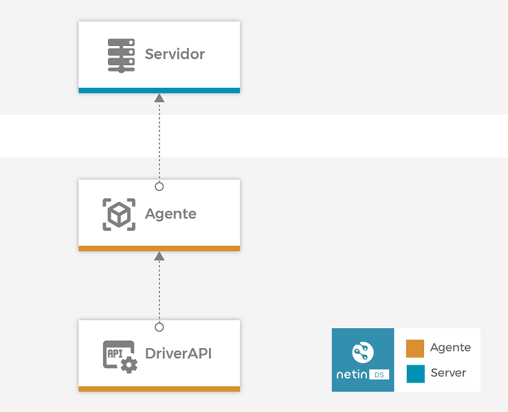

<!-- markdownlint-disable MD033 MD041 -->

<p align="center">
  <div style="text-align:center;background-color:#0091B3;">
    
  </div>
</p>

<h1 align="center">NetinDS - MQTT Broker Driver</h1>

<p align="center">
<a href="https://www.netin.io/product-netin-ds"> Librería Node.js® para NetinDS </a> - <a href="https://docs.netin.io/"> Documentación completa de NetinDS </a> - <a href="https://www.netin.io/services"> Soporte Netin Systems </a> - <a href="https://hub.docker.com/orgs/netinsystems"> NetinDS en Docker </a>
</p>

<!-- markdownlint-enable MD033 -->

[](https://snyk.io/package/npm/snyk)
[](https://devopmytra.visualstudio.com/NetinSystems/\_build/latest?definitionId=347\&repoName=NS-MQTT_Driver-NAP-TypeScript\&branchName=master)
[](https://nodejs.org/download/release/v12.13.0/)
[](https://hub.docker.com/r/netinsystems/netin-ds-drv-mqtt/tags?page=1\&ordering=last_updated)

***

## Table of Contents

*   [Introduction](#introducción)
*   [Installation](#instalación)
*   [Information](#información)
*   [Use](#uso)
*   [Collaboration](#colaboración)
*   [License](#licencia)

## **Introduction**

**NetinDS MQTT Broker Driver** belongs to the set of official drivers of **NetinDS**. The objective of this driver is to allow the collection of data from field devices that implement the MQTT protocol in a simple way.



**NetinDS MQTT Broker Driver** Allows:

*   Integrate into NetinDS information from MQTT v3.1.1 and v5 devices with QoS 0, 1 and 2.
*   Issuance of TIMEPOINTS from the driver itself.
*   Use as a local broker.
*   MQTT Proxy - Forwarded messages to other brokers.
*   White listing options for topics and clients.
*   Monitoring of the status of customers.

## **Installation**

Like the rest of the artifacts of **NetinDS**the **NetinDS MQTT Broker Driver** is distributed as a [artifact](https://docs.netin.io). It is also possible to use it through the image [docker](https://hub.docker.com/repository/docker/netinsystems/netin-ds-drv-mqtt).

## **Information**

### **Driver configuration in the templates (*originTypes*)**

The following is an example of configuring the netin-ds driver

```yml
- originType: netin-ds-drv-mqtt
  source: 10.10.10.25
  topics:
    - topicName: /this/is/myTopic
      datapointSet: myDataPointSetId
      originStrategy:
        strategyId: address
      operationMode: transform
    - topicName: /this/is/myOtherTopic
      datapointSet: myOtherDataPointSetId
      originStrategy:
        strategyId: topic
        expression: /regExp/
      operationMode: extract
```

*   `originType`: must always be `netin-ds-drv-mqtt`.
    > For multi-driver configurations contact Netin support.
*   `source`: IP address or `clientId` of the MQTT client. This value does not have to specifically match the `origin` of information, especially when the computer connected to the NetinDS system "forwards" messages from devices that are connected to it through any other system. An example of this type of configuration can be a PLC equipment(*Programmable logic controller*) which sends status information on various equipment connected to it by means of a fieldbus.
*   `topics`: specific configuration of each of the `topic` to which the driver will support. It is possible to perform several configurations for the same `topic`, in this way the driver will generate several messages (DatapointSets) for the same incoming message. This can be especially useful in the following cases:
    *   Generation of different messages for different NetinHUB services.
    *   Split a message into minor messages.

Within each `topic` we have the following parameters:

*   `topicName`: name of the `topic` or regular expression (RexExp) used to identify the `topic`. The use of regular expressions is especially useful when you want to generate the same datapointSet for several `topics`.

*   `originStrategy`: determines the strategy to be used when identifying the `origin` of the message. The configuration of this strategy is key when we are going to receive messages through some type of aggregator (see field `source`).

    The objective of these strategies is the following: in a system in which an aggregator sends the information of various equipment, we will only have one MQTT client connected to the broker, although in reality "behind it" there are several teams. Each of these computers has a `origin` different, and may even be using different NetinDS templates. In that case, in the NetinDS discovery table we will configure several computers with the same value of `source` but different `origin`. Messages posted by the aggregator may contain the information we need to be able to identify the `origin`, of that despite the fact that all the messages come from the same MQTT client, thanks to the strategy `property` we could define which message field to read to make this association.

    Possible strategies are:

    *   `topic`: the origin is extracted from the very name of the `topic` by applying a regular expression (RegExp) that we configure in the field `expression`.
        For example:

        ```yml
        - topicName: health
          datapointSet: myHealthDatapointSet
          originStrategy:
            strategyId: topic
            expression: /\/data\/\K[^\/]+/
        ```

        For messages received about the `topic`: `/data/MY_ORIGIN/health` would apply datapoint settings `myHealthDatapointSet` and I would associate it with the `origin`: `MY_ORIGIN`.

        > Remember that the field `topicName` it is also used as a RegExp.

    *   `property`: the source will be determined by applying the RegExp configured in the field `expression` regulate on the property of the message (**JSON**) addressed by in the field `property`. If no expression is indicated, the value of the property will be used. `property` must be a valid JSON path in point notation or [JSONPath](https://goessner.net/articles/JsonPath/).

        ```yml
        - topicName: health
          datapointSet: myHealthDatapointSet
          originStrategy:
            strategyId: property
            property: data.meta.name
            expression: /^[A-Z_]*/
        ```

        For a message of the type:

        ```json
        {
          "data": {
            "value1": 2,
            "value1": "text",
            "meta": {
              "name": "MY_ORIGIN@123456"
            }
          },
          "timestamp": 4
        }
        ```

        For messages received about the `topic`: `/data/ANY_REFERENCE/health` would apply datapoint settings `myHealthDatapointSet` and I would associate it with the `origin`: `MY_ORIGIN`.

    Other possible strategies, but for those cases in which there is no aggregator:

    *   `address`: We will use the client's IP address as `origen`.
    *   `clientId`: we will use the `clientId` of MQTT as `origen`.
    *   `origin`: we will use as `origin` one's own `origin` configured in the discovery tab.

*   `operationMode`: Defines how the ETL operations will be performed on the received message:
    *   `transform`: in this case the addresses must be expressions [JSONPath](https://goessner.net/articles/JsonPath/), note that this option is slower than simple extract mode, use it only if you need to apply any transformation to the message payload, and you can assume the corresponding latencies.
    *   `extract`: In this case the addresses must be expressed in JSON paths with dot notation. This option will only extract the data, without any transformation.

### **Internal datapoints of the netin-ds-drv-mqtt**

The MQTT driver has the following internal datapoints:

*   `componentId` (`string`): identification of the component, in this case, of the MQTT client. this value can be the ip address of the computer or the `deviceId` of MQTT, depending on the configuration made. NetinDS address: `netin:drv:mqtt:componentId`.
*   `componentType` (`string`): is a text string on the following format: `MQTT Client -V${version}`. NetinDS address: `netin:drv:mqtt:componentType`.
*   `time` (`string`): Date of the last update of the status of the MQTT client in ISO8601 format. NetinDS address: `netin:drv:mqtt:time`.
*   `output` (`string`|`string[]`): Error text or texts, if the MQTT client has any. NetinDS address: `netin:drv:mqtt:output`.
*   `status` (`"pass"`| `"fail"`|`"warn"`): Indicates the current status of the MQTT client. NetinDS address: `netin:drv:mqtt:status`.
*   `address` (`string`): IP address of the MQTT client. NetinDS address: `netin:drv:mqtt:address`
*   `clientId` (`string`): `clientId` of the MQTT client. NetinDS address: `netin:drv:mqtt:clientId`
*   `version` (`number`): MQTT version used by the MQTT client. NetinDS address: `netin:drv:mqtt:version`

Configuration example:

```yml
# MQTTDevice
- datapointSetType: map
  datapointSetId: MQTTDevice
  alias: MQTT device
  description: MQTT device state and information
  datapoints:
    - commonConfig:
        datapointId: componentId
        alias: Device identification
        description: 'Component identification, it should be deviceId or IP address'
        syntaxInfo: STRING
        datapointType: SIMPLE
      addressConfig:
        dataType: STRING
        originType: netin-ds-drv-mqtt
        originDataType: STRING
        originAddress: 'netin-ds-drv-mqtt:componentId'
        originAccessType: read-only
        receiveMode: polling
        pollingGroup: 10s
    - commonConfig:
        datapointId: componentType
        alias: Tipo de cliente
        description: 'Component type, it should be: MQTT Client - VX'
        syntaxInfo: STRING
        datapointType: SIMPLE
      addressConfig:
        dataType: STRING
        originType: netin-ds-drv-mqtt
        originDataType: STRING
        originAddress: 'netin-ds-drv-mqtt:componentType'
        originAccessType: read-only
        receiveMode: polling
        pollingGroup: 10s
    - commonConfig:
        datapointId: time
        alias: Last client state update date
        description: Last update of the device info in ISO8601 format
        syntaxInfo: STRING
        datapointType: SIMPLE
      addressConfig:
        dataType: STRING
        originType: netin-ds-drv-mqtt
        originDataType: STRING
        originAddress: 'netin-ds-drv-mqtt:time'
        originAccessType: read-only
        receiveMode: polling
        pollingGroup: 10s
    - commonConfig:
        datapointId: output
        alias: Error output
        description: Raw error output
        syntaxInfo: STRING
        datapointType: SIMPLE
      addressConfig:
        dataType: STRING
        originType: netin-ds-drv-mqtt
        originDataType: STRING
        originAddress: 'netin-ds-drv-mqtt:output'
        originAccessType: read-only
        receiveMode: polling
        pollingGroup: 10s
    - commonConfig:
        datapointId: status
        alias: Status
        description: Status of the MQTT device from the point of view of the broker
        syntaxInfo: STRING
        datapointType: SIMPLE
      addressConfig:
        dataType: STRING
        originType: netin-ds-drv-mqtt
        originDataType: STRING
        originAddress: 'netin-ds-drv-mqtt:status'
        originAccessType: read-only
        receiveMode: polling
        pollingGroup: 10s
    - commonConfig:
        datapointId: ipAddress
        alias: IP Address
        description: MQTT client IP Address
        syntaxInfo: STRING
        datapointType: SIMPLE
      addressConfig:
        dataType: STRING
        originType: netin-ds-drv-mqtt
        originDataType: STRING
        originAddress: 'netin-ds-drv-mqtt:address'
        originAccessType: read-only
        receiveMode: polling
        pollingGroup: 10s
    - commonConfig:
        datapointId: clientId
        alias: Client identification
        description: MQTT clientId
        syntaxInfo: STRING
        datapointType: SIMPLE
      addressConfig:
        dataType: STRING
        originType: netin-ds-drv-mqtt
        originDataType: STRING
        originAddress: 'netin-ds-drv-mqtt:clientId'
        originAccessType: read-only
        receiveMode: polling
        pollingGroup: 10s
    - commonConfig:
        datapointId: version
        alias: MQTT client version
        description: MQTT client version
        syntaxInfo: STRING
        datapointType: SIMPLE
      addressConfig:
        dataType: STRING
        originType: netin-ds-drv-mqtt
        originDataType: STRING
        originAddress: 'netin-ds-drv-mqtt:version'
        originAccessType: read-only
        receiveMode: polling
        pollingGroup: 10s
```

## **Use**

### **Environment variables**

#### NetinDS DriverAPI Configuration

#### General DriverAPI Configuration

*   **`CONFIG_DRIVER_ARTIFACT_ID`** default(`netin-ds-drv-mqtt`): Driver name from the point of view of NetinDS.
    > *Its modification is not recommended if you do not know what you are doing.*
*   **`CONFIG_DRIVER_UPDATE_INTERVAL`** default(`60000`): Interval for checking changes to the origin settings (NetinDS addresses).
*   **`CONFIG_DRIVER_AUTO_UPDATE`** default(`false`): Allow DriverAPI to automatically update the origin settings (NetinDS addresses) when changes are detected.
    > *Its modification is not recommended if you do not know what you are doing.*
*   **`CONFIG_DRIVER_LAZY_START`** default(`false`): instruct the driver to perform a roll-up process on the system at startup.
    > *Its modification is not recommended if you do not know what you are doing.*
*   **`CONFIG_DRIVER_HEALTH_PORT`** default(`29100`): port on which the observability REST API is offered [**@netin-js/DriverAPI**](https://devopmytra.visualstudio.com/NetinSystems/\_wiki/wikis/netin-js%20-%20DriverAPI/2609/-netin-js-Driver-API).
*   **`CONFIG_DRIVER_AGENT_HOST_ADDRESS`** default(`localhost`): IP address of the system where the **NetinDS Agent Engine**.
*   **`CONFIG_DRIVER_DISCOVERY_HOST_ADDRESS`** default(undefined): IP address of the host where the service is located **Discovery** of the **Netin Agent**. If configured, it will be used instead of `agentHostAddress`.
*   **`CONFIG_DRIVER_RDB_HOST_ADDRESS`** default(undefined): IP address of the host where the service is located **RDB** of the **Netin Agent**. If configured, it will be used instead of `agentHostAddress`.

#### Configuring the event log (logger) [@netin-js\logger](https://devopmytra.visualstudio.com/NetinSystems/\_packaging?\_a=package\&feed=Netin-Systems-Packages\&package=%40netin-js%2Flogger\&protocolType=Npm\&version=1.2.2)

##### Registration by console

*   **`CONFIG_LOGGER_CONSOLE_ENABLE`** default(`false`): Enabling the console logger.
*   **`CONFIG_LOGGER_CONSOLE_LEVEL`** default(`'info'`): Logging level.

##### Registration by file

*   **`CONFIG_LOGGER_FILE_ENABLE`** default(`true`): Enabling the file logger.
*   **`CONFIG_LOGGER_FILE_LEVEL`** default(`'info'`): Logging level.
*   **`CONFIG_LOGGER_FILE_FILE_NAME`** default(`'logs/netin-ds-drv-mqtt.log'`): Name of the log file.
*   **`CONFIG_LOGGER_FILE_MAX_FILES`** default(`10`): Maximum number of files (rotational).
*   **`CONFIG_LOGGER_FILE_MAX_SIZE`** default(`10 * 1000000`): Maximum size in bytes of the file.
*   **`CONFIG_LOGGER_FILE_ZIPPED`** default(`true`): indicates that all log files are compressed except the one that is currently being written
*   **`CONFIG_LOGGER_FILE_JSON`** default(`false`): Indicates whether the format is json or string, default is string.

##### Registration using the ***fluentd***

*   **`CONFIG_LOGGER_FLUENTD_ENABLE`** default(`false`): enabling the logger using fluentd.
*   **`CONFIG_LOGGER_FLUENTD_LEVEL`** default(`'info'`): Logging level.
*   **`CONFIG_LOGGER_FLUENTD_HOST`** default(`'localhost'`): Host where the fluentd service is located.
*   **`CONFIG_LOGGER_FLUENTD_PORT`** default(`28930`): Host where the fluentd service is located.
*   **`CONFIG_LOGGER_FLUENTD_TIMEOUT`** default(`5000`—Sets socket downtime.
*   **`CONFIG_LOGGER_FLUENTD_ACK_RESPONSE`** default(`true`): Changes the protocol to at-least-one. The logger will wait for the ack of the service.
*   **`CONFIG_LOGGER_FLUENTD_RECONNECT_INTERVAL`** default(`5000`):Sets the reconnection interval to milliseconds.
*   **`CONFIG_LOGGER_FLUENTD_EVENT_MODE`** default(`'Message'`— configures the way events are handled. They are supported `Message`, `PackedForward` and `CompressedPackedForward`. See [Event Modes](https://github.com/fluent/fluentd/wiki/Forward-Protocol-Specification-v1#event-modes).
*   **`CONFIG_LOGGER_FLUENTD_TLS`** default(`false`): Enables the use of TLS on this socket.
*   **`CONFIG_LOGGER_FLUENTD_FLUSH_INTERVAL`** default(`2000`): Has no effect on Message Mode. The logger stores the events and sends them in each flush interval.
*   **`CONFIG_LOGGER_FLUENTD_MESSAGE_SEND_QUEUE_SIZE`** default(`100 * 1024 * 1024`): Has no effect on Message Mode. The size of the message queue in bytes.

##### Logging levels

The logging levels, being stacked levels, each level complements the previous level showing greater detail of the same event or flow. Using the right level for each type of record is of great importance, especially in production systems where a high level of logs can greatly reduce the performance of the systems:

*   `error`: Any error that is fatal to the operation, but does not have to be fatal to the service or application. These types of errors require the intervention of system administrators or users to correct the problem.
*   `warn`: Events that can cause unwanted behavior on the system, the system tries to recover itself from the event, but strange behavior could occur in the application.
*   `info`: Useful information for system administrator users (start/stop, application version, connections with external resources ...)
*   `verbose`: Useful information to know all the steps performed by an application, aimed at administrator users who try to know the decision making the basis of decision making or the base reason for the events of an application or system.
*   `debug`: - Information that is useful for the diagnosis of systems or services, not only for developers (configurations, operating modes ...).
*   `silly`: - Specific information used to plot the behavior of the code in a specific functionality.

#### MQTT Broker Configuration

#### Configuring the service

*   **`CONFIG_BROKER_HOST`** default(`0.0.0.0`): IP address over which the MQTT broker is bound.
*   **`CONFIG_BROKER_PORT`** default(`1883`): port on which the service is offered.
*   **`CONFIG_BROKER_MODE`** default(`tcp`): MQTT broker operating mode. Valid options are `tcp` or `tls`, the latter forces the configuration of certificates for the MQTT broker.
*   **`CONFIG_BROKER_FILE_CERT_PATH`** default(`certs/cert-broker.pem`): Path to the certificate file for the server. Only used in mode `tls`.
*   **`CONFIG_BROKER_FILE_KEY_PATH`** default(`certs/key-broker.pem`): Path to the private key file. Only used in mode `tls`.
*   **`CONFIG_BROKER_FILE_CA_PATH`** default(`certs/ca-broker.pem`): Path to the CA certificate file. Only used in mode `tls`.

#### Performance settings and limits

*   **`CONFIG_BROKER_CONCURRENCY`** default(`100`): Number of concurrent messages handled by the broker. This value is independent of the size of the buffer for publishing datapoints on NetinDS, that is, it is a buffer prior to that of the NetinDS DriverAPI itself.
*   **`CONFIG_BROKER_QUEUE_LIMIT`** default(`42`): Maximum number of queued messages before the MQTT appliance establishes the session.
    > *This option is established for future uses of the MQTT broker, in its version 1.X.X the system is one-way, that is, there should be no subscribers connected to the broker, only producers. Although it is entirely possible to configure the system to allow subscriptions.*
*   **`CONFIG_BROKER_MAX_CLIENTS_LENGTH`** default(`23`): Maximum clientId size of MQTT clients.
*   **`CONFIG_BROKER_HEARTBEAT_INTERVAL`** default(`60000`): duration of the publication interval of the *heartbeat* about the channel `$SYS/${CONFIG_BROKER_ID}/heartbeat`.
*   **`CONFIG_BROKER_ID`** default(`netin-ds-drv-mqtt`): Identifier of the MQTT broker, used in the broker's diagnostic topics.
*   **`CONFIG_BROKER_CONNECT_TIMEOUT`** default(`30000`): Maximum timeout for the MQTT client to send a packet [`CONNECT`](https://en.wikipedia.org/wiki/MQTT) after establishing the TCP connection.
*   **`CONFIG_BROKER_MQ_MIDDLEWARE`** default(`default`): Message exchange mode. In the case of use, `cluster` of the system this variable must be configured as `redis` and the Redis options (see other environment variables) must be correctly configured. Valid options are `default` Or `redis`.
    > *The option to operate in cluster mode has not been declared stable in version 1.X.X.*
*   **`CONFIG_BROKER_PERSISTENCE_MIDDLEWARE`** default(`default`): Middleware that stores messages `QoS > 0`, `retained` and `LWT` (*Last Will Testament*). If it is necessary to manage these messages through a persistence system, it is recommended to use, together with cluster mode, Redis, for which this variable must be configured as `redis` and the Redis options (see other environment variables) must be correctly configured.
    > *This option is established for future uses of the MQTT broker, in its version 1.X.X the system is one-way, that is, there should be no subscribers connected to the broker, only producers. Although it is entirely possible to configure the system to allow subscriptions. Without subscribers, the management of these types of messages is meaningless*

#### Security Settings

*   **`CONFIG_BROKER_USERNAME`** default(`undefined`): Single user used for MQTT client validation. Optional.
*   **`CONFIG_BROKER_PASSWORD`** default(`undefined`): Unique password used for MQTT client validation. Optional.
*   **`CONFIG_BROKER_WHITE_LISTED_ORIGINS`** default(`true`): This option indicates that only those devices configured in NetinDS will be allowed to connect to the broker.
*   **`CONFIG_BROKER_WHITE_LISTED_PUBLICATIONS_TOPICS`** default(`false`): with this option indicates that only messages are allowed to publish to topic that comply with the RegExp indicated in the variable `CONFIG_BROKER_PUBLICATIONS_REGEXP`.
*   **`CONFIG_BROKER_PUBLICATIONS_REGEXP`** default(`[\\s\\S]*`): RegExp used for topic validation in publishing processes. Only used if `CONFIG_BROKER_WHITE_LISTED_PUBLICATIONS_TOPICS` is `true`.
*   **`CONFIG_BROKER_ALLOW_SUBSCRIPTIONS`** default(`false`): This option indicates whether or not it is possible to subscribe to broker topics.
*   **`CONFIG_BROKER_WHITE_LISTED_SUBSCRIPTIONS_TOPICS`** default(`false`): with this option indicates that only messages are allowed to publish to topic that comply with the RegExp indicated in the variable `CONFIG_BROKER_SUBSCRIPTIONS_REGEXP`.
*   **`CONFIG_BROKER_SUBSCRIPTIONS_REGEXP`** default(`[\\s\\S]*`): RegExp used for topic validation of subscription processes. Only used if `CONFIG_BROKER_WHITE_LISTED_SUBSCRIPTIONS_TOPICS` is `true`.

#### Configuring message forwarding

*   **`CONFIG_BROKER_PROXY_ENABLED`** default(`false`):Enables forwarding of messages published by clients messages to another broker.
*   **`CONFIG_BROKER_PROXY_URL`** default(`''`): URL for connection with the MQTT broker, the protocols used can be: `mqtt`, `mqtts`, `tcp`, `tls`, `ws`, `wss`. For options *Safe* remember to configure `CONFIG_BROKER_PROXY_MODE` how `tls`, as well as include the corresponding certificates and their configuration through the path variables `CONFIG_BROKER_PROXY_***_PATH` listed below.
*   **`CONFIG_BROKER_PROXY_TOPIC`** default(`''`): Topic where messages should be forwarded.
*   **`CONFIG_BROKER_PROXY_USERNAME`** default(`undefined`): User used by the MQTT proxy.
*   **`CONFIG_BROKER_PROXY_PASSWORD`** default(`undefined`): Password used by the MQTT proxy.
*   **`CONFIG_BROKER_PROXY_CLIENT_ID`** default(`netin-ds-drv-mqtt`): ClientId used by the MQTT proxy.
*   **`CONFIG_BROKER_PROXY_MODE`** default(`tcp`): MQTT proxy operating mode. Valid options are `tcp` or `tls`, the latter forces the configuration of certificates for the MQTT proxy.
*   **`CONFIG_BROKER_PROXY_FILE_CERT_PATH`** default(`certs/cert-proxy-client.pem`): Path to the certificate file for the proxy. Only used in mode `tls`.
*   **`CONFIG_BROKER_PROXY_FILE_KEY_PATH`** default(`certs/key-proxy-client.pem`): Path to the private key file. Only used in mode `tls`.
*   **`CONFIG_BROKER_PROXY_FILE_CA_PATH`** default(`certs/ca-proxy-client.pem`): Path to the CA certificate file. Only used in mode `tls`.

#### Troubleshooting settings

*   **`CONFIG_BROKER_DEBUG_MODE`** default(`false`— configures the broker in debug mode, allowing to record all interactions with connected MQTT clients.

#### Configuring Redis middleware for persistence and clustering

*   **`CONFIG_MIDDLEWARE_REDIS_ADDR`** default(`'redis://127.0.0.1:28910/1'`): Connection URL to the Redis instance. It can also be configured using the variables: `CONFIG_MIDDLEWARE_REDIS_HOST`, `CONFIG_MIDDLEWARE_REDIS_PORT` and `CONFIG_MIDDLEWARE_REDIS_DB`.
*   **`CONFIG_MIDDLEWARE_REDIS_HOST`** default(`'127.0.0.1'`): IP address where the Redis instance is located.
*   **`CONFIG_MIDDLEWARE_REDIS_PORT`** default(`28910`): Port where the Redis instance is located.
*   **`CONFIG_MIDDLEWARE_REDIS_DB`** default(`1`): DB number to use.
*   **`CONFIG_MIDDLEWARE_REDIS_USERNAME`** default(`undefined`): Redis user.
*   **`CONFIG_MIDDLEWARE_REDIS_PASSWORD`** default(`undefined`): Redis password.
*   **`CONFIG_MIDDLEWARE_REDIS_RETRY_DELAY_FACTOR`** default(`2000`): Connection retry factor in milliseconds, that is, cadence added to each retry.
*   **`CONFIG_MIDDLEWARE_REDIS_RETRY_DELAY_MAX`** default(`60000`): Maximum time between retrying connections.
*   **`CONFIG_MIDDLEWARE_REDIS_KEEPALIVE`** default(`10000`): keep alive of the connection with Redis.
*   **`CONFIG_MIDDLEWARE_REDIS_CONNECTION_TIMEOUT`** default(`10000`): Timeout for establishing the connection to the Redis instance.
*   **`CONFIG_MIDDLEWARE_REDIS_LAZY_START`** default(`true`): Start communication at startup.
    > *Modification of the variable is not recommended if you do not know what you are doing.*

## Collaboration

As in the rest of the repositories of **Netin Systems**, all collaboration is always welcome.

If you believe that an error exists, create a [bug](https://docs.microsoft.com/en-us/azure/devops/boards/backlogs/manage-bugs) providing all possible information.

If you want to make a new contribution, create a new branch, respecting at all times the flow of versions established by [GitFlow](https://www.atlassian.com/es/git/tutorials/comparing-workflows/gitflow-workflow), make your modifications to it and request approval of the same by [Pull Request](https://docs.microsoft.com/en-us/azure/devops/repos/git/pull-requests?view=azure-devops), correctly filling in the template of the same.

## License

Copyright 2021 Network Intelligence S.L. All rights reserved.

Note: All information contained herein is, and remains the property of Network Intelligence S.L. and its suppliers, if any. The intellectual and technical concepts contained herein are property of Network Intelligence S.L. and its suppliers and may be covered by European and Foreign patents, patents in process, and are protected by trade secret or copyright.
Dissemination of this information or the reproduction of this material is strictly forbidden unless prior written permission is obtained from Network Intelligence.
